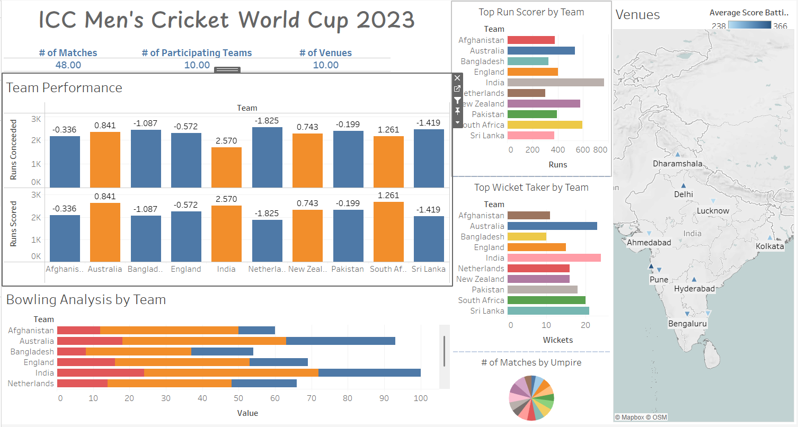

# 🏏 Cricket World Cup 2023 Analysis Dashboard (Tableau)

This project features an **interactive Tableau dashboard** built to analyze and visualize key statistics from the **2023 ICC Men's Cricket World Cup**.

## 📊 Dashboard Highlights

The dashboard provides an in-depth look at:

- **Top Run-Scorers**: Visual breakdown of players with the highest runs
- **Leading Wicket-Takers**: Analysis of top-performing bowlers
- **Team Performance**: Comparative insights into how each team fared throughout the tournament
- **Venue Comparison**: Analyze average batting scores and trends on whether to bat or bowl first by venue
- **Umpire Distribution**: A pie chart showing how many matches each umpire officiated

## 🚀 Features

- Fully interactive and user-friendly interface
- Dynamic visualizations for enhanced exploration
- Venue-based analysis to support strategic match insights
- Umpire-based breakdown to highlight match officiating patterns
- Designed for intuitive navigation and quick insights

## 📁 Repository Contents

- `CWC23 Dashboard.twb`: Tableau Packaged Workbook containing the complete dashboard
- CSV files with raw data used to power the visualizations

## 🛠️ How to Use

1. Clone or download this repository
2. Open `CWC23 Dashboard.twb` using **Tableau Desktop** or **Tableau Public**
3. Explore the dashboard using the built-in filters and charts

## 📌 Notes

Ensure the CSV files remain in the same directory as the `.twb` file to avoid broken data sources (if applicable).

## 🖼️ Dashboard Preview

## 📜 License

This project is released under the MIT License.
